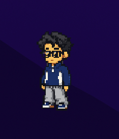
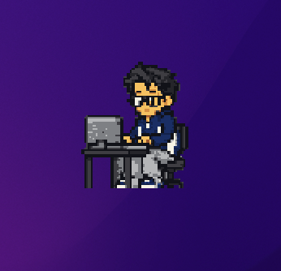
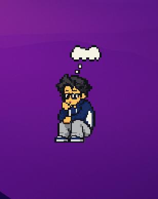
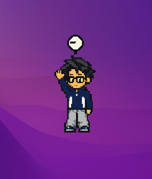
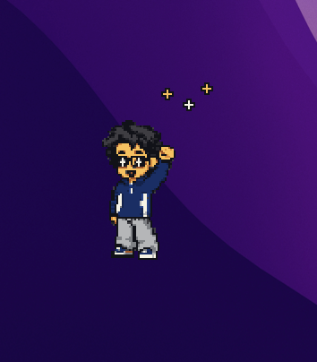
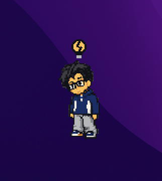
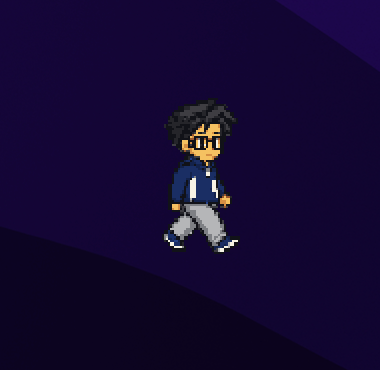
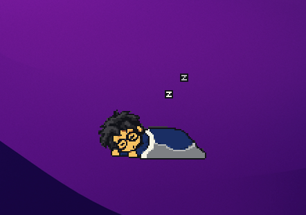

# PokeDesk

A tiny pixel-art mascot that lives at the bottom of your Mac's screen and shows,
at a glance, what your coding agent is doing. It never activates over your work,
never appears until you summon it, and never reads a single character of your
prompts, code, or terminal output.

---

## Table of contents

- [Version 1.0](#version-10)
- [Privacy](#privacy)
- [Power and CPU](#power-and-cpu)
- [Requirements](#requirements)
- [What it looks like](#what-it-looks-like)
- [Install](#install)
- [Connect it to your agent](#connect-it-to-your-agent)
- [Using it](#using-it)
- [Troubleshooting](#troubleshooting)
- [Uninstall](#uninstall)
- [Repository layout](#repository-layout)
- [Contributing](#contributing)
- [License](#license)

---

## Version 1.0

This is the first public release. It is feature-complete and used daily by its
author. Here is what it does not do yet, stated plainly before you install it:

- **macOS only.** macOS 14.4 or later. There is no Windows or Linux build, and
  none is planned — this is a native AppKit app, not a cross-platform one.
- **One character.** You get the default mascot. You cannot swap the sprite or
  bring your own art. **Customization is the headline feature for v2.**
- **Two agents.** Claude Code and Codex (the ChatGPT desktop app). Cursor,
  Gemini CLI, Aider, and Copilot are not wired up — each needs its own hooks.
  Browser chats are not supported and will not be: detecting them means reading
  your active tab's URL, which is your browsing history.
- **You build it yourself.** There is no signed, notarized download, because
  notarization requires a paid Apple Developer account. See [Install](#install).
- **No launch at login.** Add it to Login Items yourself if you want it back
  after a restart.
- **It costs a little power.** Around 2.2% idle CPU with one pet on screen. See
  [Power and CPU](#power-and-cpu) for the full picture.
- **It does not dodge your interface.** While roaming, the pet walks in front of
  whatever is behind it. It does not avoid your cursor, buttons, or windows.
- **Chat detection is experimental and off by default.** Claude desktop app
  only, it needs Accessibility permission, and it keys on a single English UI
  string — if that string is renamed by an app update, the pet quietly stops
  reacting.

Deeper detail on all of this, plus the development history and QA status, is in
[`DETAILED_README.md`](DETAILED_README.md).

## Privacy

PokeDesk is built so that it *cannot* learn anything interesting about you, not
merely so that it promises not to.

- **No network access.** No accounts, no servers, no telemetry, no update check.
- **No content, ever.** Hooks carry a lifecycle event name and nothing else.
  Prompts, transcripts, source code, file paths, tool arguments, tool output,
  and repository names are never read and never stored.
- **Session IDs are hashed** inside the hook helper before they leave the
  process, and every other payload key is dropped without being inspected.
- **No private APIs**, and nothing is injected into the macOS Dock.
- **The socket is yours alone** — a Unix-domain socket under your own user's
  directory, not a network port. Nothing is written outside the app's own
  preferences, and your agent's config files are never modified.
- **One opt-in exception: chat detection.** It is off unless you turn it on.
  With Accessibility permission it reads one attribute on one element of the
  Claude window — whether a message is currently streaming — and nothing else.
  No message text, prompts, window titles, or browser tabs. The full,
  unabridged explanation is in [`DETAILED_README.md`](DETAILED_README.md).

## Power and CPU

> 🔋 **~2.2% idle CPU** with one pet on screen — roughly what `launchd` costs on
> the same machine. Dismiss the pet and it drops to about **0.4%**.
>
> ⚡️ The animation loop runs at **12 Hz** and **stops completely** whenever the
> pet is hidden behind a window, so a covered pet costs nothing to animate.

## Requirements

**To run it**

- **macOS 14.4 or later.** A hard floor — the menu bar uses `NSHostingMenu`,
  which does not exist before 14.4.
- **Apple Silicon or Intel.** Both work.
- **Claude Code, the Codex CLI, or both**, if you want the pet to react to
  anything. Without them it simply strolls.
- **Nothing else.** No third-party runtime dependencies and no network access.

**To build it** — required, since there is no download

- **Xcode 16 or later**, with a Swift 6 toolchain. Install it from the App Store
  and run it once so the command line tools are registered.

**Only if you are changing the artwork**

- **Python 3** with [Pillow](https://pillow.readthedocs.io/) — `pip3 install Pillow`
- **[XcodeGen](https://github.com/yonaskolb/XcodeGen)** — `brew install xcodegen`.
  Needed only if you edit `project.yml`; the generated Xcode project is
  committed, so a plain build does not need it.

## What it looks like


The orange mascot is reacting to a live Claude Code session — sitting at its
computer, typing. The navy one has no Codex session to report on, so it carries
on strolling. Each pet only ever reacts to its own provider.

There is one mascot per provider, and each has its own wardrobe:

| Provider | Wardrobe | Mascot |
| --- | --- | --- |
| Claude Code | Orange and white top |  |
| Codex | Navy and white top |  |

Each mascot reacts only to its own provider's sessions, so you can run both at
once and tell them apart. Neither appears on its own — you summon each one from
the menu bar.

The states the pet can show, and when you see them:

| State | When | Mascot |
| --- | --- | --- |
| Working | Claude Code or Codex is running a turn — you sent a prompt, or the agent is using tools |  |
| Ideating | You set it by hand from the menu, or the Claude desktop app is composing a reply |  |
| Waiting | The turn cannot continue without you — a permission request or a question |  |
| Success | A turn finished. This says the turn ended, not that everything inside it worked |  |
| Failure | A turn ended in an error — the only turn-level failure either provider reports |  |
| Chilling / offline | No agent is running. The pet strolls the bottom of your screen and dozes between walks |  |
| Sleeping | The clock is inside your sleep window — 23:00–06:00 by default, adjustable from the menu |  |
| Paused | You chose Pause from the menu |  |

The state pictures show the Codex mascot; the Claude one does all of the same
things, in orange.

When several sessions are active at once, they reduce deterministically in this
priority order:

```text
paused > failure > waiting > manual ideating > working > success > chat ideating > sleep > idle > offline
```

## Install

```bash
git clone https://github.com/Mr-Shine09/PokeDesk.git
cd PokeDesk
./tools/install_app.sh
```

The script builds a Release configuration, signs it, and installs it to
`~/Applications/Dock Pet.app`. That path is durable across reboots, which
matters because the agent hooks you configure below point at an absolute path.

> **On the name:** the app was called Dock Pet until recently. The built app,
> the helper binary (`dockpet-event`), and the bundle identifier still use the
> old name on purpose — renaming them would break every hook people have already
> installed. Everywhere you see `Dock Pet.app` or `dockpet-event` below, that is
> current and correct.

**On signing:** the script uses a real Developer certificate if it finds one in
your keychain and falls back to ad-hoc signing otherwise. Ad-hoc is fine — the
app is trusted because *you* built it on *this* machine. It also means the app
cannot be copied to someone else's Mac; they need to build their own. There is
no notarized build because notarization requires a paid Apple Developer Program
certificate.

If `codesign` fails with `errSecInternalComponent`, run the script from an
interactive Terminal window rather than an IDE or an agent session — it needs to
be able to show you a keychain prompt.

Launch it:

```bash
open -g ~/Applications/Dock\ Pet.app
```

`-g` starts it in the background so it does not steal focus. A paw print appears
in your menu bar. **Nothing appears on screen yet** — that is deliberate.
Summoning is always manual.

PokeDesk does not install a login item and does not launch at login. If you want
it running after a restart, add `~/Applications/Dock Pet.app` to
**System Settings → General → Login Items** yourself.

## Connect it to your agent

PokeDesk listens for lifecycle events from your coding agent over a private,
per-user Unix socket. You wire that up with your agent's hook configuration.

**PokeDesk never edits your agent's config files.** It prints a snippet and you
paste it. A tool that silently rewrites the settings of the thing you actually
work in is a bad neighbor.

1. Click the paw print in the menu bar.
2. Open **Agent Hook Setup**.
3. Click **Copy Claude Code Setup** or **Copy Codex Setup**.
4. Paste into the right file:
   - Claude Code → `~/.claude/settings.json`
   - Codex → `~/.codex/hooks.json`
5. **Merge, don't replace.** If the file already has a `hooks` object, fold the
   new events into it. The snippet is not a whole settings file.
6. Restart your agent session. Codex will also ask you to trust each new hook.

You can get the same snippet from the command line:

```bash
'/Users/YOUR_NAME/Applications/Dock Pet.app/Contents/MacOS/dockpet-event' --print-hooks --provider claude-code
```

To check that events are arriving, open the menu again and look at the
`Event socket:` and `Reduced state:` lines. Or send one by hand:

```bash
'/Users/YOUR_NAME/Applications/Dock Pet.app/Contents/MacOS/dockpet-event' --provider claude-code --event active --session demo --verbose
```

The mascot should sit down at its computer. Note that a session expires after
120 seconds of silence, so a `completed` sent long after its `active` is ignored
as belonging to an unknown session.

The hook helper is built to be harmless: it exits `0` for every outcome except a
malformed command line, including when PokeDesk is not running at all. A hook
must never fail or stall your real agent session.

## Using it

Click the menu bar paw print:

| Item | What it does |
| --- | --- |
| **Summon / Dismiss ⟨mascot⟩** | One entry per provider. Each is independent |
| **Pause** | Freezes animation for both mascots |
| **Manual Ideating** | Forces the thinking pose — for ordinary chats that emit no hooks |
| **Think While Claude Is Answering** | Makes the Claude mascot think while the Claude desktop app is producing a response, and fist-pump when it lands. Needs Accessibility permission; see [Privacy](#privacy) for exactly what it reads |
| **Chat Detection (Experimental)** | Grants the permission, reports what the detector currently sees, and writes a diagnostic report. Temporary, while the feature is being proven |
| **Sounds** | Mutes all four cues (success, failure, summon, dismiss) |
| **⟨mascot⟩ Stays in One Place** | One entry per mascot, next to its Summon. Checked, that pet stops strolling and stays exactly where it is, still animating in place — drag it somewhere first and it stays there, across relaunches. Unchecked (the default), it roams. The two mascots are independent |
| **Reposition on Current Display** | Returns the pet to the default bottom lane |
| **Sleep Schedule** | Sets the hours the pet sleeps, or switches scheduled sleep off entirely |
| **Preview State** | Forces any animation without needing a real agent. Good for a first look |
| **Agent Hook Setup** | Copies the config snippet described above |
| **Quit Dock Pet** | Plays the farewell, then quits. The item still carries the old name — see the note under [Install](#install) |

You can also interact with the pet directly:

- **Click or right-click** it for Pause, Stay in One Place, Dismiss, and Quit.
  Stay in One Place here affects only the pet you clicked.
- **Drag** it anywhere, at any time. It grabs on with one hand while you drag.
  Dropping is placement only — it keeps roaming, at whatever height you let go
  at. Use **Reposition** to send it back to the bottom.
- **To pin a pet in one spot**, drag it where you want it and tick **Stay in
  One Place** — from its own click menu, or from its entry in the menu bar. It
  stays put and keeps its idle animation, and still reacts to your agent
  normally, since working, waiting, and the rest are stationary poses anyway.
  Each mascot is set independently, and the choice survives relaunch.

Summoning and dismissing are animated: the pet steps out of a portal at the
Dock, and on dismiss it forms a two-handed seal and vanishes in a puff of smoke.
If you have **Reduce Motion** enabled in System Settings, both become simple
fades instead.

## Troubleshooting

**No paw print in the menu bar.**
Check that the process is running with `pgrep -fl "Dock Pet"`. If it is running
and there is still no icon, you may have previously dragged the icon out of the
menu bar — macOS remembers that against the app's bundle identifier, in a store
the app cannot reach, and it cannot be undone from inside the app. Reset the
menu bar layout in System Settings, or file an issue.

**The pet never appears.**
That is correct until you summon it. Menu bar → **Summon**.

**Nothing reacts when my agent runs.**
In order: confirm the hook snippet landed in the right file and merged with any
existing `hooks` object; confirm the path in the snippet matches where the app
actually is (a rebuild into a different location invalidates it); restart the
agent session; for Codex, confirm the hooks show as trusted and Active. Then
check the `Event socket:` line in the menu — it should say the listener is
bound — and send a manual event with the `dockpet-event` command above to
isolate whether the problem is the app or the hook.

**My code change seems to do nothing.**
`open -g` sends a reopen event to an already-running process instead of
relaunching it, so you are testing the old binary. Quit first:

```bash
osascript -e 'quit app id "com.mrshine09.dockpet"'
```

**The build fails, or tests fail right after I add a property to a public struct.**
Run `swift package clean` in `Packages/DesktopMascotKit` — the incremental build
can keep a stale module with the old memory layout and produce convincing
nonsense.

**Tests pass in the morning and fail at night.**
One test fixture family reduces against the 23:00–06:00 sleep window. A fixture
that uses the real clock instead of an injected instant will do exactly this.

## Uninstall

```bash
osascript -e 'quit app id "com.mrshine09.dockpet"'
rm -rf ~/Applications/Dock\ Pet.app
defaults delete com.mrshine09.dockpet
```

Then remove the PokeDesk entries from `~/.claude/settings.json` and
`~/.codex/hooks.json` by hand. PokeDesk did not write them, so it does not
remove them.

## Repository layout

```text
DesktopMascot/App/           SwiftUI app shell, menu bar, ambient controller
Packages/DesktopMascotKit/   Core, animation, window, and transport modules,
                             plus the dockpet-event helper executable
art/production/              The frozen base mascot — do not replace
art/animation/               Atlas contract, source frames, atlases, QA output
art/audio/                   Synthesized WAV cues
tools/                       Deterministic art build and validation scripts
project.yml                  XcodeGen source of truth for the Xcode project
docs/                        Build, architecture, asset, and QA documentation
DesktopMascot.md             The authoritative project ledger and history
```

Deeper reading:

- [`DETAILED_README.md`](DETAILED_README.md) — the long-form version of this file
- [`docs/DEVELOPMENT.md`](docs/DEVELOPMENT.md) — build, test, run, and workflow
- [`docs/ARCHITECTURE.md`](docs/ARCHITECTURE.md) — components and state flow
- [`docs/ASSET_PIPELINE.md`](docs/ASSET_PIPELINE.md) — how the sprite atlas is made
- [`docs/QA_CHECKLIST.md`](docs/QA_CHECKLIST.md) — the acceptance matrix
- [`DesktopMascot.md`](DesktopMascot.md) — every decision, and why

## Contributing

Contributions are welcome. Please read [`CONTRIBUTING.md`](CONTRIBUTING.md)
first — this project has a few hard invariants (the character identity is
frozen, the privacy boundary is not negotiable, and the Xcode project is
generated rather than hand-edited) that will save you a wasted pull request.

Security issues: see [`SECURITY.md`](SECURITY.md).

## License

**Code** is [MIT](LICENSE).

**Artwork and audio are not.** The mascot depicts the project owner and is
licensed separately and restrictively — you may build and run PokeDesk, but you
may not reuse the character elsewhere. See [`art/LICENSE.md`](art/LICENSE.md).
